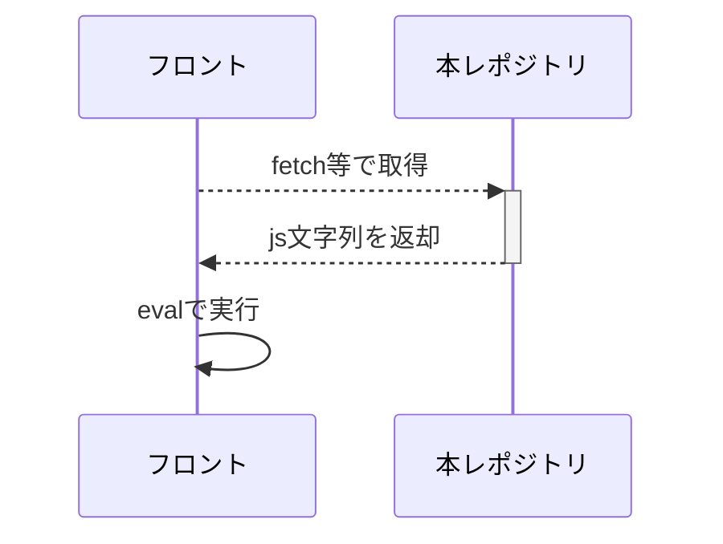

# doc-template

<!-- Description -->
This repository is `JS Util Function API` by GitHub Pages.

---

#### App Profile
<!-- Badges -->
<table>
  <tr>
    <td>License</td>
    <td>Lang</td>
    <td>Editor</td>
  </tr>
  <tr>
    <td>
      <a href="./LICENSE">
        
      </a>
    </td>
    <td>
      
      
      <br>
      
    </td>
    <td>
      
    </td>
  </tr>
</table>

#### Author Profile
<table>
  <tr>
    <!-- Start -->
    <td>
      
    </td>
    <!-- Lang -->
    <td>
      
    </td>
    <!-- Follow -->
    <td>
      <div>
        <!-- Twitter -->
        <div>
          <a href="https://twitter.com/serna37serna37">
            
          </a>
        </div>
        <!-- Github -->
        <div>
          <a href="https://github.com/serna37">
            
          </a>
        </div>
        <!-- Qiita -->
        <div>
          <a href="https://qiita.com/neras_1215">
            
          </a>
        </div>
      </div>
    </td>
  </tr>
</table>

#### Online Editors (Links)
<table>
  <thead>
    <td>Markdown</td>
    <td>Runtime</td>
    <td>Other Markdown</td>
    <td>Need Account</td>
    <td>GitHub ChromeExt</td>
  </thead>
  <tr>
    <td>
      <div>
        <!-- StackEdit -->
        <div>
          <a href="https://stackedit.io/app#">
            
          </a>
        </div>
        <!-- Marxi -->
        <div>
          <a href="https://marxi.co/">
            
          </a>
        </div>
      </div>
    </td>
    <td>
      <div>
        <!-- WandBox -->
        <div>
          <a href="https://wandbox.org/">
            
          </a>
        </div>
        <!-- OnlineGDB -->
        <div>
          <a href="https://www.onlinegdb.com/online_c_compiler">
            
          </a>
        </div>
        <!-- CodeChef -->
        <div>
          <a href="https://www.codechef.com/ide">
            
          </a>
        </div>
      </div>
    </td>
    <td>
      <div>
        <!-- Mermaid -->
        <div>
          <a href="https://mermaid-js.github.io/mermaid-live-editor/edit#pako:eNpVjstqw0AMRX9FaNVC_ANeFBq7zSbQQrPzZCFsOTMk80CWCcH2v3ccb1qtxD3nCk3Yxo6xxP4W760lUTjVJkCe96ay4gb1NJyhKN7mAyv4GPgxw_7lEGGwMSUXLq-bv18lqKbjqjGodeG6bKh69r8Cz1A3R0oa0_kvOd3jDB-N-7b5_H9ihXPrs-mp7KloSaAieSq4Q8_iyXX5_WlNDKplzwbLvHYkV4MmLNmjUePPI7RYqoy8wzF1pFw7ugj5LVx-AfLqVWg">
            
          </a>
        </div>
        <!-- LaTex -->
        <div>
          <a href="https://josephernest.github.io/writing/">
            
          </a>
        </div>
        <!-- serna's_editor -->
        <div>
          <a href="https://neras-sta.com/web-editor/">
            
          </a>
        </div>
      </div>
    </td>
    <td>
      <div>
        <!-- CodeHS -->
        <div>
          <a href="https://codehs.com/sandbox?ref=20">
            
          </a>
        </div>
        <!-- CodePen -->
        <div>
          <a href="https://codepen.io/your-work/">
            
          </a>
        </div>
        <!-- CodeSandbox -->
        <div>
          <a href="https://codesandbox.io/dashboard/recent">
            
          </a>
        </div>
      </div>
    </td>
    <td>
      <div>
        <!-- GitHubIDE -->
        <div>
          <a href="https://chromewebstore.google.com/detail/github-web-ide/adjiklnjodbiaioggfpbpkhbfcnhgkfe">
            
          </a>
        </div>
      </div>
    </td>
  </tr>
</table>

---

# ER
[live editor](https://mermaid-js.github.io/mermaid-live-editor/edit#pako:eNpVjstqw0AMRX9FaNVC_ANeFBq7zSbQQrPzZCFsOTMk80CWCcH2v3ccb1qtxD3nCk3Yxo6xxP4W760lUTjVJkCe96ay4gb1NJyhKN7mAyv4GPgxw_7lEGGwMSUXLq-bv18lqKbjqjGodeG6bKh69r8Cz1A3R0oa0_kvOd3jDB-N-7b5_H9ihXPrs-mp7KloSaAieSq4Q8_iyXX5_WlNDKplzwbLvHYkV4MmLNmjUePPI7RYqoy8wzF1pFw7ugj5LVx-AfLqVWg)



# API IF
|status|method|endpoint|feature|remarks|
|--|--|--|--|--|
|<ul><li>[ ] </ul>|`GET`|`/msg`|メッセージ表示||

# Basic
```javascript
// あくまでHTMLを返却するため、MIMEタイプに注意する
const res = await fetch("https://xxxx...url").then(v => v.text())

// 変数スコープを絞るため、基本的にwindowに登録
window.someObject = {
    func1: v => console.log(v),
    func2: () => console.log("")
};
window.someObject.func1("some"); // このように呼ぶ
```

# Usage
> [!Warning]
> CSP設定のあるサイトからは呼べないため注意

```javascript
javascript: (async () => {
    await fetch("https://serna37.github.io/util-js-api/msg").then(v => v.ok && v.text()).then(eval);
})();
```
